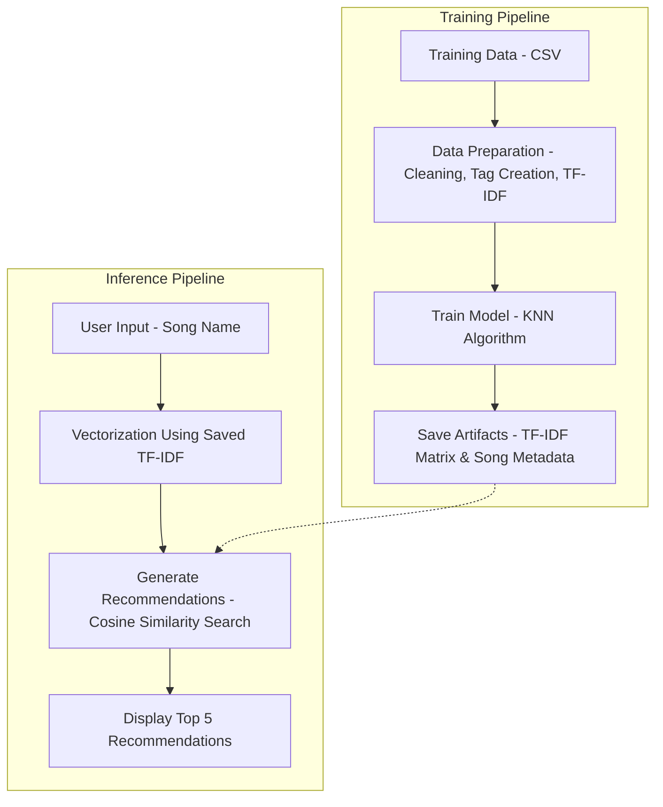

# Bollywood Song Recommendation System 🎵🎬

## 📌 Project Overview
This project is a **Content-Based Recommendation System** designed to suggest Bollywood songs based on a selected song. By analyzing song attributes such as **Genre, Artists, Album/Movie, and User Ratings**, the system identifies and recommends the top 5 most similar songs using **Machine Learning**.

The application is built using **Python, Flask, and Scikit-Learn** and is deployed on **Render**.

---

## 📂 Dataset Details
The model is trained on a dataset containing **2,407 Bollywood songs**.

- **Source File**: `Bollywood_songs.csv`
- **Total Records**: 2407
- **Key Features**:
  - `Song-Name`: Name of the track.
  - `Artists`: Singers and music composers.
  - `Genre`: Category of the song (e.g., Romantic, Dance).
  - `Album/Movie`: The movie or album the song belongs to.
  - `User-Rating`: Rating of the song (normalized for the model).

---

## ⚙️ Machine Learning Pipeline
The recommendation logic is implemented in `bollyecom.ipynb`. Here is the step-by-step pipeline:

### 1. ML Operations Architecture (Training vs Inference)



This architecture reflects the parallel processes of:
1.  **Training Pipeline**: Processing raw data to create the model and feature matrix.
2.  **Inference Pipeline**: Using the saved artifacts to generate real-time recommendations for user input.


### 1. Data Cleaning & Preprocessing
- **Handling Missing Values**: Removed rows with null values using `dropna()`.
- **Text Cleaning**:
  - Removed spaces from `Artists`, `Genre`, and `Album/Movie` names to treat them as unique tags (e.g., "Arijit Singh" → "ArijitSingh").
  - Converted all text to **lowercase** for consistency.

### 2. Feature Engineering
- Created a new **`tag`** column by concatenating:
  - `Genre` + `Artists` + `Album/Movie` + `User-Rating`
- This `tag` serves as the primary textual feature for calculating similarity.

### 3. Vectorization
- Used **TF-IDF Vectorizer (Term Frequency-Inverse Document Frequency)** to convert the `tag` text data into numerical vectors.
- This highlights unique importance of specific artists or genres while downplaying common words.

### 4. Model Building (Similarity Search)
- **Algorithm**: `NearestNeighbors` from `sklearn`.
- **Metric**: `cosine` similarity.
- **Configuration**: `n_neighbors=6` (1 for the input song itself + 5 recommendations).
- The model calculates the cosine distance between the input song vector and all other song vectors to find the closest matches.

---

## 🏗️ Project Structure
```
├── app.py                  # Main Flask application file
├── bollyecom.ipynb         # Jupyter Notebook for ML pipeline & model training
├── Bollywood_songs.csv     # Raw dataset
├── features_matrix.pkl     # Serialized TF-IDF matrix (Model Artifact)
├── Song_list.pkl           # Serialized DataFrame with song metadata
├── requirement.txt         # List of dependencies
├── static/                 # CSS and images
└── templates/              # HTML templates (index.html)
```

---

## 🛠️ Tech Stack
- **Language**: Python 3.x
- **Web Framework**: Flask
- **Machine Learning**: Scikit-Learn (TF-IDF, NearestNeighbors)
- **Data Manipulation**: Pandas, NumPy
- **Deployment**: Render

---

## 🚀 Installation & Usage

### Prerequisites
- Python installed on your system.

### Steps to Run Locally
1. **Clone the Repository**
   ```bash
   git clone <repository-url>
   cd Bollywood-Song-Recommedation-master
   ```

2. **Install Dependencies**
   ```bash
   pip install -r requirement.txt
   ```

3. **Run the Application**
   ```bash
   python app.py
   ```

4. **Access the App**
   Open your browser and go to: `http://127.0.0.1:5000/`

---

## 🌐 Deployment
The application is fully deployed and accessible on **Render**.
- **Deployment Platform**: Render
- **WSGI Server**: Gunicorn

To deploy updates:
1. Ensure `requirement.txt` includes `gunicorn`.
2. Push changes to GitHub.
3. Render will automatically build and deploy the latest version.

---

## 🧠 What You Learn From This Project
- **End-to-End ML**: From data cleaning to model deployment.
- **NLP Techniques**: Text preprocessing and TF-IDF vectorization.
- **Recommender Systems**: Implementing content-based filtering using Cosine Similarity.
- **Web Integration**: Serving an ML model via a Flask API.
